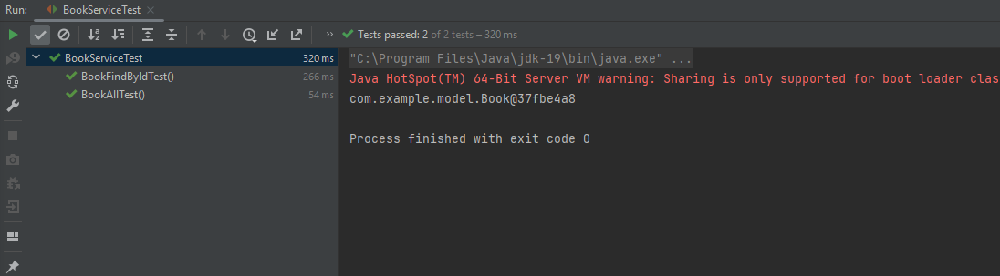

### Задание 1. Ответьте письменно на вопросы:

1)  Почему использование тестовых заглушек может быть полезным при написании модульных тестов?
    - чаще всего, классы используют зависимости от других компонентов,
    - поэтому, чтобы протестировать изолированно класс, метод или модуль, полезно сделать заглушки на 
    - те элементы, от которых зависит тестируемый объект.

2) Какой тип тестовой заглушки следует использовать, если вам нужно проверить, что метод был вызван с определенными аргументами?
   - скорее всего подойдет dummy 

3) Какой тип тестовой заглушки следует использовать, если вам просто нужно вернуть определенное значение или исключение в ответ на вызов метода?
    - stub предоставляет готовый объект

4) Какой тип тестовой заглушки вы бы использовали для имитации  взаимодействия с внешним API или базой данных?
    - здесь для имитации входных параметров подойдет mock, а для выходных, вроде баз данных, может подойти fake

### Задание 2.

* У вас есть класс BookService, который использует интерфейс BookRepository для получения информации о книгах из базы данных. 
* Ваша задача написать unit-тесты для BookService, используя Mockito для создания мок-объекта BookRepository.

